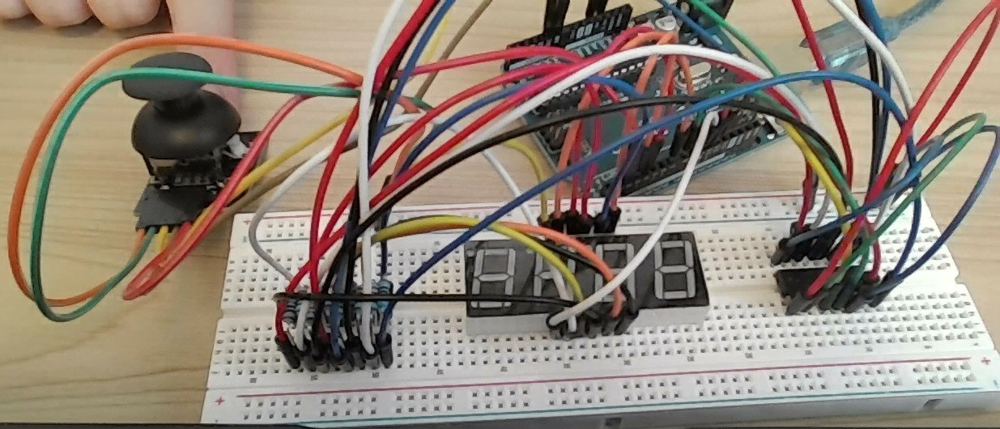

# 成果発表レポート

> 記入者: 長谷川祐介
> グループ: （グループID）
> 日付: 2026/05/27

> **📝 このレポートをそのまま発表原稿にできます。**
> 各セクションの指示を消して、自分の言葉で書いてください。
> 1人 **約2分**（グループ5人で10〜12分）に収まる分量が目安です。

---

## 1. 何を作ったか（30秒）

<!-- ひと言で伝わるように書いてください。「○○を使って、△△するガジェットを作りました。」 -->

**ガジェット名：**
ジョイスティックで4 Digit 7-Segment Displayを操作してLEDの点灯を操作しよう

**ひと言で説明：**
ジョイスティックで4 Digit 7-Segment Displayを操作してLEDの点灯を操作するガジェット

**使った部品：**
- ジョイスティック
- 4 Digit 7-Segment Display
- RGB LED
- 74HC595

---

## 2. 設計で考えたこと（15秒）

<!-- 要件定義・基本設計・詳細設計の中で、自分なりに考えたこと・工夫した点を書いてください -->
<!-- 「なぜこの部品を選んだか」「なぜこの構成にしたか」など、判断の理由を言葉にしてください -->

この部品を選んだ理由はスティックを使った際に傾けたら動くそしてそれでまたなにか起こるといいなと思ったからです

---

## 3. できたこと・できなかったこと（30秒）

<!-- 正直に書いてください。「できなかった」も立派な成果です -->

**動いたもの：**
- ジョイスティック
- 4 Digit 7-Segment Display

**動かなかった・間に合わなかったもの：**
- RGB LED
- なぜ動かなかったか（わかる範囲で）： 4 Digit 7-Segment Displayの実装中ジャンパワイヤの量が多かったがゆえにいっぱい使った後に上手く動かずワイヤの異常だと考えやり直しを決行したため多くの時間を取られてしまったのが大部分の理由です

---

## 4. 一番苦労したこと、どう乗り越えたか（30秒）

<!-- ここが発表の山場です。1つだけに絞って、ストーリーで書いてください -->

**何が起きたか：**
4 Digit 7-Segment Displayが上手く表示されず間違いも見当たらなかった

**どう対処したか：**
一度ワイヤを全て外して、外したワイヤが正常に動いているか確認した

**そこから何がわかったか：**
1本正常に動いていないワイヤがあったためそれが問題で動かなかった

---

## 5. 学んだこと・今後の展望（25秒）

<!-- 「勉強になった」ではなく具体的に。 -->
<!-- 例: 「AIが生成したコードをそのまま使ったら動かず、自分でprintfデバッグして原因を特定した」 -->
<!-- 例: 「配線図を書かずに組んだら混乱した。図を書いてからやり直したらすぐ動いた」 -->

**学んだこと：**
- まずは使うワイヤは全て動くか確認する

**今後の展望（この仕組みを発展させるなら）：**
<!-- 例: 「温度センサー＋モーターの組み合わせを応用すれば、室温に応じて自動で換気する仕組みが作れそう」 -->

- この仕組みを使えばこんなものを作れるという具体的なものは浮かびませんが色々と使えそうなものだと思いました

---

## 6. 発表で見せたいもの（メモ）

<!-- 動くデモ、配線の写真、設計図、フローチャート、AIとのやり取りのスクショなど -->
<!-- 動くものがなくても、「考えた過程」を見せられれば十分です -->

- 

---

> **💡 書き終わったら**
> - 声に出して読んで、2分に収まるか確認してください
> - 長すぎたら「4. 苦労したこと」を1つに絞りましょう
> - グループで導入・締めをつけたい場合は、次の時間に相談して決めてください
