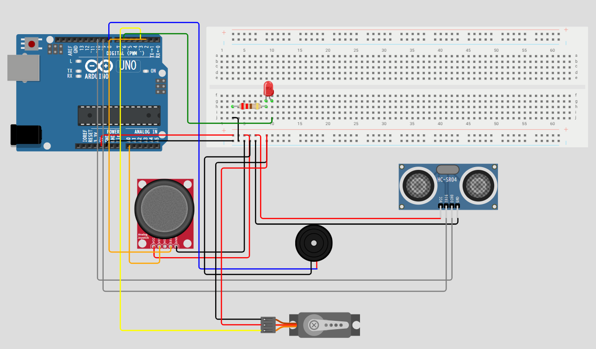

# 成果発表レポート

> 記入者: （名前）
> グループ: （グループID）
> 日付: 2026/05/27

> **📝 このレポートをそのまま発表原稿にできます。**
> 各セクションの指示を消して、自分の言葉で書いてください。
> 1人 **約2分**（グループ5人で10〜12分）に収まる分量が目安です。

---

## 1. 何を作ったか（30秒）

<!-- ひと言で伝わるように書いてください。「○○を使って、△△するガジェットを作りました。」 -->

**ガジェット名：**
超音波スキャン警報システム

**ひと言で説明：**
ジョイスティックでサーボモーターを回転させ、超音波センサーで周囲をスキャンして、物体を検知するとLEDとブザーで警報するシステムです。

**使った部品：**
- ジョイスティック
- SG90サーボモーター
- HC‑SR04超音波センサー
- LED
- アクティブブザー

---

## 2. 設計で考えたこと（15秒）

<!-- 要件定義・基本設計・詳細設計の中で、自分なりに考えたこと・工夫した点を書いてください -->
<!-- 「なぜこの部品を選んだか」「なぜこの構成にしたか」など、判断の理由を言葉にしてください -->
- ジョイスティックでサーボモーターを動かし、サーボに付けた超音波センサーで周りを調べること
- 物を見つけたときは、LEDの光とブザーの音で知らせすること

---

## 3. できたこと・できなかったこと（30秒）

<!-- 正直に書いてください。「できなかった」も立派な成果です -->

**動いたもの：**
- ジョイスティックを使ってサーボモーターを動かす
- 超音波センサーで周りを調べる
- LEDやアクティブブザーで警報する

**動かなかった・間に合わなかったもの：**
- なし
- なぜ動かなかったか（わかる範囲で）：

---

## 4. 一番苦労したこと、どう乗り越えたか（30秒）

<!-- ここが発表の山場です。1つだけに絞って、ストーリーで書いてください -->

**何が起きたか：**
コード書くより回路図書くの方が不安でした。経験が少しありましたが、自分一人でやるのは初めてでした。

**どう対処したか：**
組み込み研修で習ったことをよく復習して、作る前にWOKWIというサイトで先にシミュレーションしました。

**そこから何がわかったか：**
各部品の動作や、配線の基本を理解できました。

---

## 5. 学んだこと・今後の展望（25秒）

<!-- 「勉強になった」ではなく具体的に。 -->
<!-- 例: 「AIが生成したコードをそのまま使ったら動かず、自分でprintfデバッグして原因を特定した」 -->
<!-- 例: 「配線図を書かずに組んだら混乱した。図を書いてからやり直したらすぐ動いた」 -->

**学んだこと：**
- ほぼコードはAIに作ってもらいましたが、VSCode上でAIが意図しないファイル作成や削除をすることがあり、その管理が大変でした。
- 基本設計と詳細設計も、最初は自分のアイデアをもとにAIに相談しながら書きました。ただ、分からない内容や不要な提案も含まれていたため、内容を自分で確認して取捨選択する必要があると学びました。

**今後の展望（この仕組みを発展させるなら）：**
<!-- 例: 「温度センサー＋モーターの組み合わせを応用すれば、室温に応じて自動で換気する仕組みが作れそう」 -->

- バッテリーとモーター、無線操作機能を追加すれば、移動しながら周囲をスキャンできる小型ロボットに発展させられると考えています。

---

## 6. 発表で見せたいもの（メモ）

<!-- 動くデモ、配線の写真、設計図、フローチャート、AIとのやり取りのスクショなど -->
<!-- 動くものがなくても、「考えた過程」を見せられれば十分です -->

---

> **💡 書き終わったら**
> - 声に出して読んで、2分に収まるか確認してください
> - 長すぎたら「4. 苦労したこと」を1つに絞りましょう
> - グループで導入・締めをつけたい場合は、次の時間に相談して決めてください
